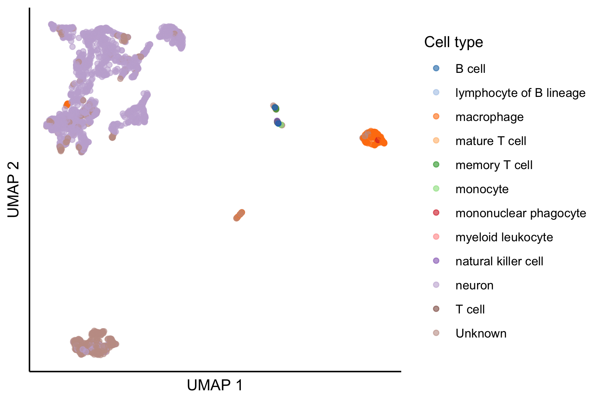

# Introduction

The ScPCAr package provides an interface to interact with the Single-cell Pediatric Cancer Atlas (ScPCA) Portal API.
This vignette demonstrates the basic workflow for discovering, downloading, and working with ScPCA data.

This vignette covers the following tasks for interacting with the ScPCA Portal:

1. Listing available projects
2. Selecting a project and exploring its samples
3. Obtaining an authentication token
4. Downloading data for individual samples
5. Loading the data into R

# Installing the ScPCAr Package

The ScPCAr package is currently available via GitHub.
You can install the latest version using the `remotes` package:


``` r
# Install remotes if needed
if (!requireNamespace("remotes", quietly = TRUE)) {
  install.packages("remotes")
}

# Install ScPCAr from GitHub
remotes::install_github("Alexslemonade/ScPCAr")
```

You can then load the `ScPCAr` package.
Note that in this vignette we will use `ScPCAr::` when calling functions from the package, both for clarity and to avoid any possible namespace conflicts.
We will also load the `SingleCellExperiment` package for later analysis.


``` r
library(ScPCAr)
library(SingleCellExperiment)
```

# Exploring available projects

## Listing all projects

First, let's see what projects are available in the ScPCA Portal:


``` r
# Get a data frame of all projects
projects <- ScPCAr::scpca_projects()

# print out a portion of the data frame
head(projects)
```

```
## # A tibble: 6 × 23
##   scpca_project_id sample_count title    pi_name abstract additional_restricti…¹
##   <chr>                   <int> <chr>    <chr>   <chr>    <chr>                 
## 1 SCPCP000001                23 Single … green_… Pediatr… Research or academic …
## 2 SCPCP000002                26 Single … green_… Pediatr… Research or academic …
## 3 SCPCP000003                59 Single … teache… Early T… Research or academic …
## 4 SCPCP000006                45 Single … murphy… Wilms t… Research or academic …
## 5 SCPCP000007                30 Single-… gawad   Bulk ge… Research or academic …
## 6 SCPCP000008               104 Single-… mullig… Acute l… Research or academic …
## # ℹ abbreviated name: ¹​additional_restrictions
## # ℹ 17 more variables: created_at <dttm>, downloadable_sample_count <int>,
## #   has_bulk_rna_seq <lgl>, has_cite_seq_data <lgl>,
## #   has_multiplexed_data <lgl>, has_single_cell_data <lgl>,
## #   has_spatial_data <lgl>, human_readable_pi_name <chr>,
## #   includes_anndata <lgl>, includes_cell_lines <lgl>,
## #   includes_merged_anndata <lgl>, includes_merged_sce <lgl>, …
```

The `scpca_projects()` function returns a data frame with basic project metadata.
By default, it returns a simplified version with list columns removed for easier viewing.
You can see the full structure with additional data such as a list of diagnoses, data types, external accession numbers, etc., by setting `simplify = FALSE`:


``` r
# Get the full project information including list columns
projects_full <- ScPCAr::scpca_projects(simplify = FALSE)

# View the structure of the full data frame
dplyr::glimpse(projects_full)
```

```
## Rows: 23
## Columns: 37
## $ scpca_project_id          <chr> "SCPCP000001", "SCPCP000002", "SCPCP000003",…
## $ sample_count              <int> 23, 26, 59, 45, 30, 104, 39, 42, 11, 33, 10,…
## $ title                     <chr> "Single cell RNA sequencing of pediatric hig…
## $ pi_name                   <chr> "green_mulcahy_levy", "green_mulcahy_levy", …
## $ abstract                  <chr> "Pediatric brain tumors are now the most com…
## $ additional_metadata_keys  <list> <"development_stage_ontology_term_id", "dis…
## $ additional_restrictions   <chr> "Research or academic purposes only", "Resea…
## $ computed_files            <list> [<data.frame[5 x 17]>], [<data.frame[5 x 17…
## $ contacts                  <list> [<data.frame[1 x 2]>], [<data.frame[1 x 2]>…
## $ created_at                <dttm> 2025-08-26, 2025-08-26, 2025-08-26, 2025-08…
## $ diagnoses_counts          <df[,56]> <data.frame[23 x 56]>
## $ diagnoses                 <list> <"Anaplastic astrocytoma", "Anaplastic g…
## $ disease_timings           <list> <"Metastatic recurrence of anaplastic pleom…
## $ downloadable_sample_count <int> 23, 26, 59, 43, 30, 104, 38, 42, 11, 33, 10…
## $ external_accessions       <list> [<data.frame[4 x 3]>], [<data.frame[0 x 0]>]…
## $ has_bulk_rna_seq          <lgl> TRUE, TRUE, TRUE, TRUE, FALSE, FALSE, TRUE,…
## $ has_cite_seq_data         <lgl> FALSE, FALSE, TRUE, FALSE, TRUE, TRUE, FALSE…
## $ has_multiplexed_data      <lgl> FALSE, FALSE, FALSE, FALSE, FALSE, FALSE, TR…
## $ has_single_cell_data      <lgl> TRUE, TRUE, TRUE, TRUE, TRUE, TRUE, TRUE, TR…
## $ has_spatial_data          <lgl> FALSE, FALSE, FALSE, TRUE, FALSE, FALSE, FAL…
## $ human_readable_pi_name    <chr> "Green/Mulcahy Levy", "Green/Mulcahy Levy", …
## $ includes_anndata          <lgl> TRUE, TRUE, TRUE, TRUE, TRUE, TRUE, TRUE, TR…
## $ includes_cell_lines       <lgl> FALSE, FALSE, FALSE, FALSE, FALSE, FALSE, FA…
## $ includes_merged_anndata   <lgl> TRUE, TRUE, TRUE, TRUE, TRUE, FALSE, FALSE, …
## $ includes_merged_sce       <lgl> TRUE, TRUE, TRUE, TRUE, TRUE, FALSE, FALSE, …
## $ includes_xenografts       <lgl> FALSE, FALSE, TRUE, FALSE, FALSE, FALSE, FAL…
## $ metadata_dataset_id       <lgl> NA, NA, NA, NA, NA, NA, NA, NA, NA, NA, NA, …
## $ modalities                <list> <"SINGLE_CELL", "BULK_RNA_SEQ">, <"SINGLE_CE…
## $ multiplexed_sample_count  <int> 0, 0, 0, 0, 0, 0, 34, 0, 0, 0, 0, 0, 0, 0, …
## $ organisms                 <list> "Homo sapiens", "Homo sapiens", "Homo sapien…
## $ publications              <list> [<data.frame[1 x 3]>], [<data.frame[0 x 0]>…
## $ samples                   <list> <"SCPCS000001", "SCPCS000002", "SCPCS000003…
## $ seq_units                 <list> "cell", "cell", "cell", <"nucleus", "spot">…
## $ summaries                 <list> [<data.frame[7 x 5]>], [<data.frame[5 x 5]>…
## $ technologies              <list> "10Xv3", "10Xv3", "10Xv3", <"10Xv3.1", "vis…
## $ unavailable_samples_count <int> 0, 0, 0, 2, 0, 0, 1, 0, 0, 0, 0, 0, 0, 1, 0…
## $ updated_at                <dttm> 2025-08-26, 2025-08-26, 2025-08-26, 2025-08-…
```


## Getting detailed project information

Now let's get more detailed information about the samples in a selected project.
We will use the first project, `SCPCP000001`, as an example.
According to the project info above, these samples are from a study of pediatric high-grade gliomas.
We can get more detailed information about this project using its `project_id`, and here we will set `simplifyVector = TRUE` to convert simple lists into vectors where possible.


``` r
project_id <- "SCPCP000001"

# Get detailed project metadata
project_info <- ScPCAr::get_project_info(project_id)
```

This returns a `list` with more detailed information about the project and the samples within.
You can explore the full structure of this list with `str()` or `dplyr::glimpse()`, but for now we will just look at a few of the components that might be of interest.

For example, we can look at the set of diagnoses that are present, and their counts:


``` r
data.frame(count = unlist(project_info$diagnoses_counts)) |>
  tibble::rownames_to_column("diagnosis")
```

```
##                       diagnosis count
## 1                  Glioblastoma    16
## 2                 Non-cancerous     1
## 3             Anaplastic glioma     1
## 4             High-grade glioma     2
## 5        Anaplastic astrocytoma     1
## 6        Diffuse midline glioma     1
## 7 Pleomorphic xanthoastrocytoma     1
```

Similarly, we can look at the data modalities available for this project, which here includes both single-cell and bulk RNA-seq data:


``` r
project_info$modalities
```

```
## [1] "SINGLE_CELL"  "BULK_RNA_SEQ"
```


# Exploring sample information

## Getting sample metadata

Let's look at the samples within our selected project:


``` r
# Get sample information for the project
samples <- ScPCAr::get_project_samples(project_id)
head(samples)
```

```
## # A tibble: 6 × 34
##   scpca_sample_id scpca_project_id outcome  organism submitter_id participant_id
##   <chr>           <chr>            <chr>    <chr>    <chr>        <chr>         
## 1 SCPCS000001     SCPCP000001      PFS 11 … Homo sa… 834          834           
## 2 SCPCS000002     SCPCP000001      PFS 11 … Homo sa… 1107         1107          
## 3 SCPCS000003     SCPCP000001      PFS 7 m… Homo sa… 1115         1115          
## 4 SCPCS000004     SCPCP000001      PFS 3 m… Homo sa… 1431         1431          
## 5 SCPCS000005     SCPCP000001      PFS 3 m… Homo sa… 1437         1437          
## 6 SCPCS000006     SCPCP000001      Stable … Homo sa… 1458         1458          
## # ℹ 28 more variables: organism_ontology_id <chr>, sex_ontology_term_id <chr>,
## #   tissue_ontology_term_id <chr>, disease_ontology_term_id <chr>,
## #   molecular_characteristics <chr>, spinal_leptomeningeal_mets <chr>,
## #   development_stage_ontology_term_id <chr>,
## #   self_reported_ethnicity_ontology_term_id <chr>, age <dbl>,
## #   age_timing <chr>, created_at <dttm>, demux_cell_count_estimate_sum <lgl>,
## #   diagnosis <chr>, disease_timing <chr>, has_bulk_rna_seq <lgl>, …
```

## Getting detailed sample information

We can also get detailed information for a specific sample:


``` r
sample_id <- "SCPCS000001"
# Get detailed sample metadata
sample_detail <- ScPCAr::get_sample_info(sample_id)
str(sample_detail, max.level = 1)
```

```
## List of 28
##  $ additional_metadata          :List of 12
##  $ age                          : chr "14"
##  $ age_timing                   : chr "diagnosis"
##  $ computed_files               :'data.frame':	2 obs. of  17 variables:
##  $ created_at                   : chr "2025-08-26T07:31:52.502575Z"
##  $ demux_cell_count_estimate_sum: NULL
##  $ diagnosis                    : chr "Anaplastic glioma"
##  $ disease_timing               : chr "Initial diagnosis"
##  $ has_bulk_rna_seq             : logi TRUE
##  $ has_cite_seq_data            : logi FALSE
##  $ has_multiplexed_data         : logi FALSE
##  $ has_single_cell_data         : logi TRUE
##  $ has_spatial_data             : logi FALSE
##  $ includes_anndata             : logi TRUE
##  $ is_cell_line                 : logi FALSE
##  $ is_xenograft                 : logi FALSE
##  $ modalities                   : chr [1:2] "SINGLE_CELL" "BULK_RNA_SEQ"
##  $ multiplexed_with             : list()
##  $ project                      :List of 37
##  $ sample_cell_count_estimate   : int 3422
##  $ scpca_id                     : chr "SCPCS000001"
##  $ seq_units                    : chr [1:2] "bulk" "cell"
##  $ sex                          : chr "F"
##  $ subdiagnosis                 : chr "NA"
##  $ technologies                 : chr [1:2] "10Xv3" "paired_end"
##  $ tissue_location              : chr "Right thalamus/midbrain"
##  $ treatment                    : chr "Debulking, RT, irinotecan/cetuximab"
##  $ updated_at                   : chr "2025-08-26T07:31:52.502598Z"
```

``` r
# Check which data modalities are available for this sample
sample_detail$modalities
```

```
## [1] "SINGLE_CELL"  "BULK_RNA_SEQ"
```

# Authentication

To download actual data files, you need an agree to the terms of service and obtain an authentication token.
To view the terms of service in a web browser, run `view_terms()`.
Then you can use the `get_auth()` function, providing your email address and agreeing to the terms of service:


``` r
# Get an authentication token
# Replace with your actual email address
my_email <- "your.email@example.com"
auth_token <- ScPCAr::get_auth(email = my_email, agree = TRUE)
```


**Important Notes:**

- You must set `agree = TRUE` to indicate you accept the terms of service
- Replace `"your.email@example.com"` with your actual email address
- Keep your token secure and don't share it publicly

# Downloading data for an ScPCA sample

## Downloading SingleCellExperiment objects

Now we can download data for our selected sample.
We will use the `download_sample()` function, specifying the sample ID, authentication token, desired destination directory, and the file format.
The function will download and unpack the files associated with that sample, and return a list of file paths for the downloaded files
Let's start with SingleCellExperiment format:


``` r
# Download SingleCellExperiment data for our sample
# This will create a directory structure under "scpca_data/"
file_paths <- ScPCAr::download_sample(
  sample_id = "SCPCS000001",
  auth_token = auth_token,
  destination = "scpca_data",
  format = "sce"
)

# List the files that were downloaded
file_paths
```

```
## [1] "scpca_data/SCPCS000001_SINGLE-CELL_SINGLE-CELL-EXPERIMENT_2025-10-17/README.md"                       
## [2] "scpca_data/SCPCS000001_SINGLE-CELL_SINGLE-CELL-EXPERIMENT_2025-10-17/SCPCL000001_celltype-report.html"
## [3] "scpca_data/SCPCS000001_SINGLE-CELL_SINGLE-CELL-EXPERIMENT_2025-10-17/SCPCL000001_filtered.rds"        
## [4] "scpca_data/SCPCS000001_SINGLE-CELL_SINGLE-CELL-EXPERIMENT_2025-10-17/SCPCL000001_processed.rds"       
## [5] "scpca_data/SCPCS000001_SINGLE-CELL_SINGLE-CELL-EXPERIMENT_2025-10-17/SCPCL000001_qc.html"             
## [6] "scpca_data/SCPCS000001_SINGLE-CELL_SINGLE-CELL-EXPERIMENT_2025-10-17/SCPCL000001_unfiltered.rds"      
## [7] "scpca_data/SCPCS000001_SINGLE-CELL_SINGLE-CELL-EXPERIMENT_2025-10-17/single_cell_metadata.tsv"
```

## Understanding the downloaded file structure

A standard download of SingleCellExperiment data for a sample will create a directory structure like this:

```
scpca_data/
└── {sample_id}_{MODALITY}_{FORMAT}_{YYYY-MM-DD}/
    ├── README.md
    ├── single_cell_metadata.tsv
    ├── {library_id}_filtered.rds
    ├── {library_id}_processed.rds
    ├── {library_id}_unfiltered.rds
    ├── {library_id}_qc.html
    └── {library_id}_celltype-report.html
```

Note that the `library_id` and `sample_id` often have different numbers, as a single sample may have been sequenced across multiple libraries.
For details about the contents of these files, see the [ScPCA Portal documentation](https://scpca.readthedocs.io/en/latest/download_files.html).


## Loading data into R

Now let's load in the processed data for our sample.
First we will select the processed SingleCellExperiment file from the downloaded paths, then use `readRDS()` to load it.


``` r
# select the processed SCE file using a pattern match for the file name.
processed_sce_files <- stringr::str_subset(file_paths, "_processed\\.rds$")

# Load the first (in this case only) SingleCellExperiment object
sce <- readRDS(processed_sce_files[1])

# View a summary of the object
sce
```

```
## class: SingleCellExperiment 
## dim: 60319 2628 
## metadata(40): library_id sample_id ... cellassign_reference_version
##   cellassign_reference_organs
## assays(3): counts spliced logcounts
## rownames(60319): ENSG00000223972 ENSG00000243485 ... ENSG00000273496
##   ENSG00000274175
## rowData names(4): gene_ids gene_symbol mean detected
## colnames(2628): GTTCGCTGTTCTCTCG CTCTCAGCATGGATCT ... TCATACTTCTGCGAGC
##   TCTCACGAGGACGGAG
## colData names(19): barcodes sum ... consensus_celltype_annotation
##   consensus_celltype_ontology
## reducedDimNames(2): PCA UMAP
## mainExpName: NULL
## altExpNames(0):
```

## Working with the SingleCellExperiment object

Once loaded, you can work with the SingleCellExperiment object using standard Bioconductor tools.
For more information on the contents of the SingleCellExperiment objects provided by ScPCA, see the [ScPCA Portal documentation](https://scpca.readthedocs.io/en/latest/sce_file_contents.html#components-of-a-singlecellexperiment-object).


``` r
# Access count data
counts <- counts(sce)
dim(counts)
```

```
## [1] 60319  2628
```

``` r
# Access cell metadata
cell_metadata <- colData(sce)
head(cell_metadata)
```

```
## DataFrame with 6 rows and 19 columns
##                          barcodes       sum  detected subsets_mito_sum
##                       <character> <numeric> <integer>        <numeric>
## GTTCGCTGTTCTCTCG GTTCGCTGTTCTCTCG     57012      9097             1494
## CTCTCAGCATGGATCT CTCTCAGCATGGATCT     52113      8625             4064
## TCAGCCTCAGGTATGG TCAGCCTCAGGTATGG     49759      8650             5253
## CCTTGTGGTCCATAGT CCTTGTGGTCCATAGT     58121      9177             3540
## AGCGCCATCTTCGACC AGCGCCATCTTCGACC     51639      8570             5607
## CTGTAGATCCATAGGT CTGTAGATCCATAGGT     53179      8962             6712
##                  subsets_mito_detected subsets_mito_percent     total
##                              <integer>            <numeric> <numeric>
## GTTCGCTGTTCTCTCG                    13              2.62050     57012
## CTCTCAGCATGGATCT                    14              7.79844     52113
## TCAGCCTCAGGTATGG                    14             10.55688     49759
## CCTTGTGGTCCATAGT                    14              6.09074     58121
## AGCGCCATCTTCGACC                    14             10.85807     51639
## CTGTAGATCCATAGGT                    14             12.62152     53179
##                  prob_compromised miQC_pass scpca_filter sizeFactor  cluster
##                         <numeric> <logical>  <character>  <numeric> <factor>
## GTTCGCTGTTCTCTCG      6.09745e-06      TRUE         Keep    5.03806        1
## CTCTCAGCATGGATCT      8.68181e-06      TRUE         Keep    3.50519        1
## TCAGCCTCAGGTATGG      2.67246e-06      TRUE         Keep    3.59865        1
## CCTTGTGGTCCATAGT      7.71935e-07      TRUE         Keep    4.48946        1
## AGCGCCATCTTCGACC      3.74199e-06      TRUE         Keep    3.38054        1
## CTGTAGATCCATAGGT      2.00608e-07      TRUE         Keep    3.53366        1
##                  singler_celltype_ontology singler_celltype_annotation
##                                <character>                 <character>
## GTTCGCTGTTCTCTCG                CL:0000540                      neuron
## CTCTCAGCATGGATCT                CL:0000540                      neuron
## TCAGCCTCAGGTATGG                CL:0000540                      neuron
## CCTTGTGGTCCATAGT                CL:0000540                      neuron
## AGCGCCATCTTCGACC                CL:0000540                      neuron
## CTGTAGATCCATAGGT                CL:0000540                      neuron
##                  cellassign_celltype_annotation cellassign_celltype_ontology
##                                     <character>                  <character>
## GTTCGCTGTTCTCTCG            Gamma delta T cells                   CL:0000798
## CTCTCAGCATGGATCT               Purkinje neurons                   CL:0000121
## TCAGCCTCAGGTATGG               Purkinje neurons                   CL:0000121
## CCTTGTGGTCCATAGT            Gamma delta T cells                   CL:0000798
## AGCGCCATCTTCGACC               Purkinje neurons                   CL:0000121
## CTGTAGATCCATAGGT               Purkinje neurons                   CL:0000121
##                  cellassign_max_prediction consensus_celltype_annotation
##                                  <numeric>                   <character>
## GTTCGCTGTTCTCTCG                  1.000000                       Unknown
## CTCTCAGCATGGATCT                  1.000000                        neuron
## TCAGCCTCAGGTATGG                  0.963709                        neuron
## CCTTGTGGTCCATAGT                  1.000000                       Unknown
## AGCGCCATCTTCGACC                  1.000000                        neuron
## CTGTAGATCCATAGGT                  1.000000                        neuron
##                  consensus_celltype_ontology
##                                  <character>
## GTTCGCTGTTCTCTCG                          NA
## CTCTCAGCATGGATCT                  CL:0000540
## TCAGCCTCAGGTATGG                  CL:0000540
## CCTTGTGGTCCATAGT                          NA
## AGCGCCATCTTCGACC                  CL:0000540
## CTGTAGATCCATAGGT                  CL:0000540
```

``` r
# Access gene metadata
gene_metadata <- rowData(sce)
head(gene_metadata)
```

```
## DataFrame with 6 rows and 4 columns
##                        gene_ids gene_symbol        mean  detected
##                     <character> <character>   <numeric> <numeric>
## ENSG00000223972 ENSG00000223972     DDX11L1 0.000380518 0.0380518
## ENSG00000243485 ENSG00000243485 MIR1302-2HG 0.000000000 0.0000000
## ENSG00000284332 ENSG00000284332   MIR1302-2 0.000000000 0.0000000
## ENSG00000268020 ENSG00000268020      OR4G4P 0.000000000 0.0000000
## ENSG00000240361 ENSG00000240361     OR4G11P 0.000000000 0.0000000
## ENSG00000186092 ENSG00000186092       OR4F5 0.000000000 0.0000000
```

And of course we can make some standard plots, here a UMAP colored by the consensus cell type annotation.


``` r
# View the UMAP, colored by consensus cell type
scater::plotUMAP(sce, color_by = "consensus_celltype_annotation") +
  ggplot2::guides(color = ggplot2::guide_legend(title="Cell type")) +
  ggplot2::theme_classic() +
  # remove axis ticks
  ggplot2::theme(
    axis.ticks = ggplot2::element_blank(),
    axis.text = ggplot2::element_blank()
  )
```



## Downloading data in AnnData/H5AD format

`ScPCAr` also supports downloading data in AnnData (H5AD) format, which is commonly used in Python-based single-cell analysis workflows:


``` r
# Download the same sample in H5AD format
file_paths_h5ad <- ScPCAr::download_sample(
  sample_id = sample_id,
  auth_token = auth_token,
  destination = "scpca_data",
  format = "anndata"
)
```

For more about the expected files when downloading samples in this format, see the [ScPCA Portal AnnData docs](https://scpca.readthedocs.io/en/stable/download_files.html#anndata-downloads).


# Downloading projects

In addition to downloading the data for a single sample, `ScPCAr` provides a function to download an entire project, fittingly named `download_project()`.
This function takes a project id and authentication token as required input, and like the `download_sample` function allows you to specify the destination and format of the downloaded files.
There are also a few other options, such as the ability to download a merged object containing all samples in the project, and whether to include multiplexed samples, where multiple samples were pooled and sequenced together, but have not been demultiplexed.
Please see the function documentation for more information.


``` r
# Download an entire project in SingleCellExperiment format,
# with separate files for each sample (default behavior).
project_file_paths <- ScPCAr::download_project(
  project_id = project_id,
  auth_token = auth_token,
  destination = "scpca_data",
  format = "sce"
)

# Download an entire project in SingleCellExperiment format,
# with all samples merged into a single object (but not integrated!).
project_file_paths <- ScPCAr::download_project(
  project_id = project_id,
  auth_token = auth_token,
  destination = "scpca_data",
  format = "sce",
  merged = TRUE
)
```


# Session info

<details>
<summary>Click to expand R session info</summary>

``` r
sessionInfo()
```

```
## R version 4.4.3 (2025-02-28)
## Platform: aarch64-apple-darwin20
## Running under: macOS Sequoia 15.7.1
## 
## Matrix products: default
## BLAS:   /Library/Frameworks/R.framework/Versions/4.4-arm64/Resources/lib/libRblas.0.dylib 
## LAPACK: /Library/Frameworks/R.framework/Versions/4.4-arm64/Resources/lib/libRlapack.dylib;  LAPACK version 3.12.0
## 
## locale:
## [1] en_US.UTF-8/en_US.UTF-8/en_US.UTF-8/C/en_US.UTF-8/en_US.UTF-8
## 
## time zone: America/New_York
## tzcode source: internal
## 
## attached base packages:
## [1] stats4    stats     graphics  grDevices utils     datasets  methods  
## [8] base     
## 
## other attached packages:
##  [1] SingleCellExperiment_1.28.1 SummarizedExperiment_1.36.0
##  [3] Biobase_2.66.0              GenomicRanges_1.58.0       
##  [5] GenomeInfoDb_1.42.3         IRanges_2.40.1             
##  [7] S4Vectors_0.44.0            BiocGenerics_0.52.0        
##  [9] MatrixGenerics_1.18.1       matrixStats_1.4.1          
## [11] ScPCAr_0.1.0                testthat_3.2.3             
## 
## loaded via a namespace (and not attached):
##   [1] gridExtra_2.3           httr2_1.2.1             remotes_2.5.0          
##   [4] rlang_1.1.6             magrittr_2.0.3          scater_1.34.1          
##   [7] compiler_4.4.3          vctrs_0.6.5             stringr_1.5.1          
##  [10] profvis_0.4.0           pkgconfig_2.0.3         crayon_1.5.3           
##  [13] fastmap_1.2.0           XVector_0.46.0          ellipsis_0.3.2         
##  [16] labeling_0.4.3          scuttle_1.16.0          utf8_1.2.5             
##  [19] promises_1.3.0          sessioninfo_1.2.2       tzdb_0.5.0             
##  [22] UCSC.utils_1.2.0        ggbeeswarm_0.7.2        purrr_1.0.2            
##  [25] xfun_0.52               zlibbioc_1.52.0         cachem_1.1.0           
##  [28] beachmat_2.22.0         jsonlite_2.0.0          later_1.3.2            
##  [31] DelayedArray_0.32.0     BiocParallel_1.40.2     irlba_2.3.5.1          
##  [34] parallel_4.4.3          R6_2.6.1                stringi_1.8.7          
##  [37] pkgload_1.4.0           brio_1.1.5              Rcpp_1.0.13            
##  [40] knitr_1.50              usethis_3.1.0           readr_2.1.5            
##  [43] httpuv_1.6.15           Matrix_1.7-0            tidyselect_1.2.1       
##  [46] viridis_0.6.5           rstudioapi_0.17.1       abind_1.4-8            
##  [49] yaml_2.3.10             codetools_0.2-20        miniUI_0.1.1.1         
##  [52] curl_7.0.0              pkgbuild_1.4.6          lattice_0.22-6         
##  [55] tibble_3.2.1            shiny_1.9.1             withr_3.0.2            
##  [58] evaluate_1.0.3          desc_1.4.3              urlchecker_1.0.1       
##  [61] pillar_1.10.2           generics_0.1.4          rprojroot_2.0.4        
##  [64] hms_1.1.3               ggplot2_3.5.1           munsell_0.5.1          
##  [67] scales_1.3.0            xtable_1.8-4            glue_1.8.0             
##  [70] tools_4.4.3             BiocNeighbors_2.0.1     ScaledMatrix_1.14.0    
##  [73] fs_1.6.6                cowplot_1.1.3           grid_4.4.3             
##  [76] tidyr_1.3.1             devtools_2.4.5          colorspace_2.1-1       
##  [79] GenomeInfoDbData_1.2.13 beeswarm_0.4.0          BiocSingular_1.22.0    
##  [82] vipor_0.4.7             cli_3.6.5               rsvd_1.0.5             
##  [85] rappdirs_0.3.3          viridisLite_0.4.2       S4Arrays_1.6.0         
##  [88] dplyr_1.1.4             gtable_0.3.5            digest_0.6.37          
##  [91] ggrepel_0.9.6           SparseArray_1.6.2       farver_2.1.2           
##  [94] htmlwidgets_1.6.4       memoise_2.0.1           htmltools_0.5.8.1      
##  [97] lifecycle_1.0.4         httr_1.4.7              here_1.0.1             
## [100] mime_0.13
```
</details>
