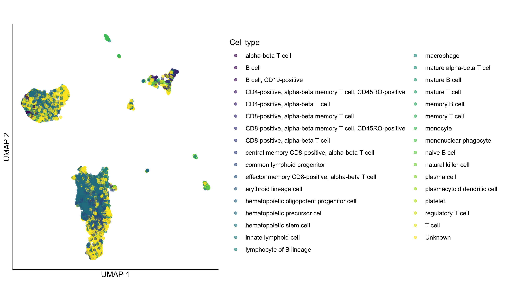

# Introduction

The ScPCAr package provides an interface to interact with the Single-cell Pediatric Cancer Atlas (ScPCA) Portal API.
This vignette demonstrates the basic workflow for discovering, downloading, and working with ScPCA data.

This vignette covers the following tasks for interacting with the ScPCA Portal:

1. Listing available projects
2. Selecting a project and exploring its samples
3. Obtaining an authentication token
4. Downloading all data for an ScPCA project
5. Creating a custom dataset with specified samples and data types
6. Loading ScPCA data into R

# Installing the ScPCAr Package

The ScPCAr package is currently available via GitHub.
You can install the latest version using the `pak` package:


``` r
# Install pak if needed
if (!requireNamespace("pak", quietly = TRUE)) {
  install.packages("pak")
}

# Install ScPCAr from GitHub
pak::pak("AlexsLemonade/ScPCAr")
```

You can then load the `ScPCAr` package.
Note that in this vignette we will use `ScPCAr::` when calling functions from the package, both for clarity and to avoid any possible namespace conflicts.
We will also load the `SingleCellExperiment` package for later analysis.


``` r
library(ScPCAr)
library(SingleCellExperiment)
```

# Exploring available projects

## Listing all projects

First, let's see what projects are available in the ScPCA Portal:


``` r
# Get a data frame of all projects
projects <- ScPCAr::scpca_projects()

# print out a portion of the data frame
head(projects)
```

```
## # A tibble: 6 × 23
##   scpca_project_id sample_count title    pi_name abstract additional_restricti…¹
##   <chr>                   <int> <chr>    <chr>   <chr>    <chr>                 
## 1 SCPCP000001                23 Single … green_… "Pediat… Research or academic …
## 2 SCPCP000003                59 Single … teache… "Early … Research or academic …
## 3 SCPCP000004                40 Profili… dyer_c… "Pediat… Research or academic …
## 4 SCPCP000005                59 Profili… dyer_c… "Pediat… Research or academic …
## 5 SCPCP000006                45 Single … murphy… "Wilms … Research or academic …
## 6 SCPCP000007                30 Single-… gawad   "Bulk g… Research or academic …
## # ℹ abbreviated name: ¹​additional_restrictions
## # ℹ 17 more variables: created_at <dttm>, downloadable_sample_count <int>,
## #   has_bulk_rna_seq <lgl>, has_cite_seq_data <lgl>,
## #   has_multiplexed_data <lgl>, has_single_cell_data <lgl>,
## #   has_spatial_data <lgl>, human_readable_pi_name <chr>,
## #   includes_anndata <lgl>, includes_cell_lines <lgl>,
## #   includes_merged_anndata <lgl>, includes_merged_sce <lgl>, …
```

The `scpca_projects()` function returns a data frame with basic project metadata.
By default, it returns a simplified version with list columns removed for easier viewing.
You can see the full structure with additional data such as a list of diagnoses, data types, external accession numbers, etc., by setting `simplify = FALSE`:


``` r
# Get the full project information including list columns
projects_full <- ScPCAr::scpca_projects(simplify = FALSE)

# View the structure of the full data frame
dplyr::glimpse(projects_full)
```

```
## Rows: 23
## Columns: 39
## $ scpca_project_id          <chr> "SCPCP000001", "SCPCP000003", "SCPCP000004",…
## $ sample_count              <int> 23, 59, 40, 59, 45, 30, 104, 39, 26, 11, 10,…
## $ title                     <chr> "Single cell RNA sequencing of pediatric hig…
## $ pi_name                   <chr> "green_mulcahy_levy", "teachey_tan", "dyer_c…
## $ abstract                  <chr> "Pediatric brain tumors are now the most com…
## $ additional_metadata_keys  <list> <"development_stage_ontology_term_id", "dis…
## $ additional_restrictions   <chr> "Research or academic purposes only", "Resea…
## $ computed_files            <list> [<data.frame[5 x 17]>], [<data.frame[5 x 17…
## $ contacts                  <list> [<data.frame[1 x 2]>], [<data.frame[2 x 2]>…
## $ created_at                <dttm> 2026-05-11, 2026-05-11, 2026-05-11, 2026-05…
## $ diagnoses_counts          <df[,56]> <data.frame[23 x 56]>
## $ diagnoses                 <list> <"Anaplastic astrocytoma", "Anaplastic g…
## $ disease_timings           <list> <"Recurrence as glioblastoma after multiple…
## $ downloadable_sample_count <int> 23, 59, 40, 59, 43, 30, 104, 38, 26, 11, 10…
## $ external_accessions       <list> [<data.frame[4 x 3]>], [<data.frame[1 x 3]>]…
## $ has_bulk_rna_seq          <lgl> TRUE, TRUE, FALSE, FALSE, TRUE, FALSE, FALS…
## $ has_cite_seq_data         <lgl> FALSE, TRUE, FALSE, FALSE, FALSE, TRUE, TRUE…
## $ has_multiplexed_data      <lgl> FALSE, FALSE, FALSE, FALSE, FALSE, FALSE, FA…
## $ has_single_cell_data      <lgl> TRUE, TRUE, TRUE, TRUE, TRUE, TRUE, TRUE, TR…
## $ has_spatial_data          <lgl> FALSE, FALSE, FALSE, FALSE, TRUE, FALSE, FAL…
## $ human_readable_pi_name    <chr> "Green/Mulcahy Levy", "Teachey/Tan", "Dyer/C…
## $ includes_anndata          <lgl> TRUE, TRUE, TRUE, TRUE, TRUE, TRUE, TRUE, TR…
## $ includes_cell_lines       <lgl> FALSE, FALSE, FALSE, FALSE, FALSE, FALSE, FA…
## $ includes_merged_anndata   <lgl> TRUE, TRUE, TRUE, TRUE, TRUE, TRUE, FALSE, F…
## $ includes_merged_sce       <lgl> TRUE, TRUE, TRUE, TRUE, TRUE, TRUE, FALSE, F…
## $ includes_xenografts       <lgl> FALSE, TRUE, TRUE, TRUE, FALSE, FALSE, FALSE…
## $ metadata_dataset_id       <chr> "a6739ab8-ab68-4af5-80c1-57780f22efd4", "11c…
## $ modalities                <list> <"SINGLE_CELL", "BULK_RNA_SEQ">, <"SINGLE_CE…
## $ multiplexed_sample_count  <int> 0, 0, 0, 0, 0, 0, 0, 34, 0, 0, 0, 0, 0, 0, …
## $ organisms                 <list> "Homo sapiens", "Homo sapiens", "Homo sapien…
## $ publications              <list> [<data.frame[1 x 3]>], [<data.frame[0 x 0]>…
## $ samples                   <list> <"SCPCS000001", "SCPCS000002", "SCPCS000003…
## $ modality_samples          <df[,2]> <data.frame[23 x 2]>
## $ multiplexed_samples       <list> <>, <>, <>, <>, <>, <>, <>, <"SCPCS000131",…
## $ seq_units                 <list> "cell", "cell", <"cell", "nucleus">, <"ce…
## $ summaries                 <list> [<data.frame[7 x 5]>], [<data.frame[4 x 5]>…
## $ technologies              <list> "10xv3", "10xv3", <"10xv2", "10xv3", "10xv3…
## $ unavailable_samples_count <int> 0, 0, 0, 0, 2, 0, 0, 1, 0, 0, 0, 0, 0, 1, 0…
## $ updated_at                <dttm> 2026-05-11, 2026-05-11, 2026-05-11, 2026-05…
```


## Getting detailed project information

Now let's get more detailed information about the samples in a selected project.
We will use the first project, `SCPCP000001`, as an example.
According to the project info above, these samples are from a study of pediatric high-grade gliomas.
We can get more detailed information about this project using its `project_id`.


``` r
project_id <- "SCPCP000001"

# Get detailed project metadata
project_info <- ScPCAr::get_project_info(project_id)
```

This returns a `list` with more detailed information about the project and the samples within.
You can explore the full structure of this list with `str()`, but for now we will just look at a few of the components that might be of interest.

For example, we can look at the set of diagnoses that are present, and their counts:


``` r
data.frame(count = unlist(project_info$diagnoses_counts)) |>
  tibble::rownames_to_column("diagnosis")
```

```
##                       diagnosis count
## 1                  Glioblastoma    16
## 2                 Non-cancerous     1
## 3             Anaplastic glioma     1
## 4             High-grade glioma     2
## 5        Anaplastic astrocytoma     1
## 6        Diffuse midline glioma     1
## 7 Pleomorphic xanthoastrocytoma     1
```

Similarly, we can look at the data modalities available for this project, which here includes both single-cell and bulk RNA-seq data:


``` r
project_info$modalities
```

```
## [1] "SINGLE_CELL"  "BULK_RNA_SEQ"
```


# Exploring sample information

## Getting sample metadata

Let's look at the samples within our selected project:


``` r
# Get sample information for the project
sample_info <- ScPCAr::get_project_samples(project_id)
head(sample_info)
```

```
## # A tibble: 6 × 34
##   scpca_sample_id scpca_project_id outcome  organism submitter_id participant_id
##   <chr>           <chr>            <chr>    <chr>    <chr>        <chr>         
## 1 SCPCS000001     SCPCP000001      PFS 11 … Homo sa… 834          834           
## 2 SCPCS000002     SCPCP000001      PFS 11 … Homo sa… 1107         1107          
## 3 SCPCS000003     SCPCP000001      PFS 7 m… Homo sa… 1115         1115          
## 4 SCPCS000004     SCPCP000001      PFS 3 m… Homo sa… 1431         1431          
## 5 SCPCS000005     SCPCP000001      PFS 3 m… Homo sa… 1437         1437          
## 6 SCPCS000006     SCPCP000001      Stable … Homo sa… 1458         1458          
## # ℹ 28 more variables: organism_ontology_id <chr>, sex_ontology_term_id <chr>,
## #   tissue_ontology_term_id <chr>, disease_ontology_term_id <chr>,
## #   molecular_characteristics <chr>, spinal_leptomeningeal_mets <chr>,
## #   development_stage_ontology_term_id <chr>,
## #   self_reported_ethnicity_ontology_term_id <chr>, age <dbl>,
## #   age_timing <chr>, created_at <dttm>, demux_cell_count_estimate_sum <lgl>,
## #   diagnosis <chr>, disease_timing <chr>, has_bulk_rna_seq <lgl>, …
```

## Getting detailed sample information

We can also get detailed information for a specific sample:


``` r
sample_id <- "SCPCS000001"
# Get detailed sample metadata
sample_detail <- ScPCAr::get_sample_info(sample_id)
str(sample_detail, max.level = 1)
```

```
## List of 28
##  $ additional_metadata          :List of 12
##  $ age                          : chr "14"
##  $ age_timing                   : chr "diagnosis"
##  $ computed_files               :'data.frame':	2 obs. of  17 variables:
##  $ created_at                   : chr "2026-05-11T15:50:13.135237Z"
##  $ demux_cell_count_estimate_sum: NULL
##  $ diagnosis                    : chr "Anaplastic glioma"
##  $ disease_timing               : chr "Initial diagnosis"
##  $ has_bulk_rna_seq             : logi TRUE
##  $ has_cite_seq_data            : logi FALSE
##  $ has_multiplexed_data         : logi FALSE
##  $ has_single_cell_data         : logi TRUE
##  $ has_spatial_data             : logi FALSE
##  $ includes_anndata             : logi TRUE
##  $ is_cell_line                 : logi FALSE
##  $ is_xenograft                 : logi FALSE
##  $ modalities                   : chr [1:2] "SINGLE_CELL" "BULK_RNA_SEQ"
##  $ multiplexed_with             : list()
##  $ project                      :List of 39
##  $ sample_cell_count_estimate   : int 3428
##  $ scpca_id                     : chr "SCPCS000001"
##  $ seq_units                    : chr [1:2] "bulk" "cell"
##  $ sex                          : chr "F"
##  $ subdiagnosis                 : chr "NA"
##  $ technologies                 : chr [1:2] "10xv3" "paired_end"
##  $ tissue_location              : chr "Right thalamus/midbrain"
##  $ treatment                    : chr "Debulking, RT, irinotecan/cetuximab"
##  $ updated_at                   : chr "2026-05-11T15:50:13.135257Z"
```


``` r
# Check which data modalities are available for this sample
sample_detail$modalities
```

```
## [1] "SINGLE_CELL"  "BULK_RNA_SEQ"
```

# Authentication

To download full data files, or to create a custom dataset, you must agree to the terms of service and obtain an authentication token.
To view the terms of service in a web browser, run `ScPCAr::view_terms()`.
Then you can use the `ScPCAr::get_auth()` function, providing your email address and agreeing to the terms of service:


``` r
# Get an authentication token
# Replace with your actual email address
my_email <- "your.email@example.com"
auth_token <- ScPCAr::get_auth(email = my_email, agree = TRUE)
```

In addition to saving your authorization token to `auth_token` (or whatever variable name you set), the `ScPCAr::get_auth()` function will store the token in the environment variable `SCPCA_AUTH_TOKEN` so it can be accessed by other `ScPCAr` functions automatically.
If you have a saved token from a previous session, you can populate the environment with a command like: `Sys.setenv("SCPCA_AUTH_TOKEN" = auth_token)` or by setting the environment variable in your shell before launching `R`.

**Important Notes:**

- You must set `agree = TRUE` to indicate you accept the terms of service
- Replace `"your.email@example.com"` with your actual email address
- Keep your token secure and don't share it publicly
- If you create a custom dataset using `ScPCAr::create_dataset()`, you will need to use the same token to access that dataset in future R sessions, so be sure to save it somewhere safe (e.g., a password manager).
  - To use your saved token the token in the future, use `Sys.setenv(SCPCA_AUTH_TOKEN = saved_token)`.

# Downloading data for an ScPCA project

There are two main ways for downloading data from the ScPCA Portal using `ScPCAr`: 

- Project downloads contain all available samples for a given project
- Custom datasets allow you to specify specific subsets of samples, including samples from separate projects

We will start with project downloads first, as they are a bit simpler, though less flexible. 

## Downloading a project in SingleCellExperiment format

We will use the `download_project()` function, specifying the project ID, desired destination directory, and the file format.
We also have the option to download a merged object with all samples contained in a single object instead of as individual objects.
The function will download and unpack the files associated with that sample, and return a list of file paths for the downloaded files.

Let's start with SingleCellExperiment format:


``` r
# Download SingleCellExperiment data for our project
# This will create a directory structure under "scpca_data/"
file_paths <- ScPCAr::download_project(
  project_id,
  destination = "scpca_data",
  format = "sce"
)

# List some of the files that were downloaded
head(file_paths)
```

```
## [1] "scpca_data/SCPCP000001_single-cell-experiment_2026-07-01/README.md"                                                           
## [2] "scpca_data/SCPCP000001_single-cell-experiment_2026-07-01/SCPCP000001_single-cell/single-cell_metadata.tsv"                    
## [3] "scpca_data/SCPCP000001_single-cell-experiment_2026-07-01/SCPCP000001_single-cell/SCPCS000001/SCPCL000001_celltype-report.html"
## [4] "scpca_data/SCPCP000001_single-cell-experiment_2026-07-01/SCPCP000001_single-cell/SCPCS000001/SCPCL000001_filtered.rds"        
## [5] "scpca_data/SCPCP000001_single-cell-experiment_2026-07-01/SCPCP000001_single-cell/SCPCS000001/SCPCL000001_processed.rds"       
## [6] "scpca_data/SCPCP000001_single-cell-experiment_2026-07-01/SCPCP000001_single-cell/SCPCS000001/SCPCL000001_qc.html"
```

### Project download file structure

A standard download of SingleCellExperiment data for a project will create a directory structure like this:

```
scpca_data
└── {project_id}_single-cell-experiment_{YYYY-MM-DD}
    ├── README.md
    ├── {project_id}_bulk
    │   ├── {project_id}_bulk_metadata.tsv
    │   └── {project_id}_bulk_quant.tsv
    └── {project_id}_single-cell
        ├── {sample1_id}
        │   ├── {library1_id}_celltype-report.html
        │   ├── {library1_id}_filtered.rds
        │   ├── {library1_id}_processed.rds
        │   ├── {library1_id}_qc.html
        │   └── {library1_id}_unfiltered.rds
        ├── {sample2_id}
        ...
        
```

Note that the `library_id` and `sample_id` often have different numbers, as a single sample may have been sequenced across multiple libraries.
For details about the contents of these files, see the [ScPCA Portal documentation](https://scpca.readthedocs.io/en/stable/download_files.html#project-downloads).

## Downloading a project in AnnData/H5AD format

`ScPCAr` also supports downloading data in AnnData (H5AD) format, which is commonly used in Python-based single-cell analysis workflows:


``` r
# Download the same project in H5AD format
file_paths_h5ad <- ScPCAr::download_project(
  project_id,
  destination = "scpca_data",
  format = "anndata"
)
```

For more about the expected files when downloading samples in this format, see the [ScPCA Portal AnnData docs](https://scpca.readthedocs.io/en/stable/download_files.html#download-folder-structure-for-anndata-project-downloads).


# Custom ScPCA datasets

The ScPCAr package supports the creation of custom datasets that allow you to choose specific samples for download, including samples from multiple projects.
After exploring the metadata with functions like `get_project_info()`, `get_project_samples()` and `get_sample_info()`, you may have a list of samples that you would like to download. 

## Creating a custom dataset

To create a custom dataset, use the `create_dataset()` function.
This will return a dataset ID that you will want to keep track of for later access to the dataset.
Note that the dataset is also tied to the authentication token, so you will need to use the same token to access the dataset later. 
**Make sure you have the token saved somewhere safe!** 
See [Authentication](#authentication) for details.

`create_dataset()` takes a vector of samples and/or a vector of projects (specified with the `projects` argument), and will return a dataset ID that you can use later to add or removed samples and projects, as well as to initiate dataset processing and download. 
Here we will make a small example dataset with two B-ALL samples from two different projects, `SCPCS000212` and `SCPCS000652`, which are from projects [SCPCP000008](https://scpca.alexslemonade.org/projects/SCPCP000008) and [SCPCS000022](https://scpca.alexslemonade.org/projects/SCPCP000022), respectively.


``` r
my_dataset <- create_dataset(samples = c("SCPCS000212", "SCPCS000652"))
```

```
## ScPCA dataset 57cc78cb-2336-446a-9022-7a5a5f2f17af created.
```

By default, single-cell data will be formatted as SingleCellExperiment objects, but you can also specify `format = "anndata"` to create a dataset with AnnData objects instead.
*Once a dataset is created, you can not change the format.
You must use `create_dataset()` to create a new dataset with a different format.*

Other options include whether or not to include bulk RNA-seq data; the default is no bulk data, but you can include bulk data with `include_bulk = "TRUE"`.
Note that the bulk data will be included for all available samples in each project that the selected samples come from, not just the specified samples.

You can also specify an email address that will be used for notification when the dataset has completed processed.
For more details on processing, [see below](#processing-and-downloading-a-custom dataset). 

### Modifying a custom dataset

To add samples or projects to a custom dataset, use the `add_dataset_samples()` function; to remove samples or projects, use the `remove_dataset_samples()` function.
You can also fully replace the contents of dataset with a new set of samples and/or projects using the `replace_dataset_data()` function.
(This may be convenient as it will not generate a new dataset ID, while rerunning `create_dataset()` would.)

Each of these functions will be available until a dataset is submitted for processing.
After dataset processing begins, you will not be able to modify the dataset contents, and you will need to create a new dataset if you want to change the samples or projects.

### Viewing the contents of a custom dataset

To view the current contents of a dataset, use the `get_dataset_info()` function, which will return a list with the dataset ID (`$id`), a table of samples (`$sample_info`), and other metadata including the chosen dataset format, processing status, etc. 


``` r
get_dataset_info(my_dataset)
```

```
## $id
## [1] "57cc78cb-2336-446a-9022-7a5a5f2f17af"
## 
## $format
## [1] "SINGLE_CELL_EXPERIMENT"
## 
## $status
## [1] "pending"
## 
## $n_samples
## [1] 2
## 
## $n_projects
## [1] 2
## 
## $sample_info
## # A tibble: 2 × 7
##   scpca_sample_id scpca_project_id seq_unit has_spatial has_bulk has_cite_seq
##   <chr>           <chr>            <chr>    <lgl>       <lgl>    <lgl>       
## 1 SCPCS000212     SCPCP000008      cell     FALSE       FALSE    FALSE       
## 2 SCPCS000652     SCPCP000022      cell     FALSE       FALSE    FALSE       
## # ℹ 1 more variable: has_multiplexed <lgl>
## 
## $merged_projects
## character(0)
```


## Processing and downloading a custom dataset

Once you are satisfied with the contents of your custom dataset, submit it for processing using the `start_dataset_processing()` function:


``` r
start_dataset_processing(my_dataset)
```

```
## ScPCA dataset 57cc78cb-2336-446a-9022-7a5a5f2f17af processing started.
```

The amount of time that a dataset takes to process varies by the number of samples included.
For a small dataset like this, it should take only a few minutes.
To check progress, run the `get_dataset_status()` function:


``` r
get_dataset_status(my_dataset)
```

```
## [1] "processing"
```

You can run this repeatedly until the sample status changes to "succeeded", at which point the dataset is ready for download, and can be downloaded with the `download_dataset` function. 
As with the `download_project()` function, you can specify a destination.
The function will also (silently) return a list of file paths for the downloaded files.

If the dataset is not done processing, this will result in an error:


``` r
my_dataset_files <- download_dataset(
  my_dataset, 
  destination = "scpca_data"
)
```

```
## Error:
## ! ScPCA dataset `57cc78cb-2336-446a-9022-7a5a5f2f17af` is not ready for download (status: processing). Use `get_dataset_status("57cc78cb-2336-446a-9022-7a5a5f2f17af")` to monitor progress. Alternatively, rerun `download_dataset() with `await_processing = TRUE` to wait for processing and download when complete.
```


If you are willing to wait for the processing to complete before performing any other work in your session (or you are using a multithreading package like `future`), you can use the `download_dataset()` function with `await_processing = TRUE`.
This option will also make sure that the dataset has been submitted for processing, if you did not previously run `start_dataset_processing()`.


``` r
my_dataset_files <- download_dataset(
  my_dataset, 
  destination = "scpca_data",
  await_processing = TRUE
)
```

```
## ℹ Waiting for dataset 57cc78cb-2336-446a-9022-7a5a5f2f17af to finish processing...
```

```
## Downloading 57cc78cb-2336-446a-9022-7a5a5f2f17af_single-cell-experiment_2026-07-01.zip...
```

```
## Unzipping to scpca_data/57cc78cb-2336-446a-9022-7a5a5f2f17af_single-cell-experiment_2026-07-01...
```
### Custom dataset download file structure

The downloaded files will be placed in a directory named with the dataset id, format, and download date.
Each project will be in a subdirectory, with each sample directory nested within that. 
Note that in this example, there were two separate libraries for the `SCPCS000652` sample, so there are two sets of files for that sample.

```
scpca_data
└── {dataset_id}_single-cell-experiment_{YYYY-MM-DD}
    ├── README.md
    ├── SCPCP000008_single-cell
    │   ├── SCPCS000212
    │   │   ├── SCPCL000286_celltype-report.html
    │   │   ├── SCPCL000286_filtered.rds
    │   │   ├── SCPCL000286_processed.rds
    │   │   ├── SCPCL000286_qc.html
    │   │   └── SCPCL000286_unfiltered.rds
    │   └── single-cell_metadata.tsv
    └── SCPCP000022_single-cell
        ├── SCPCS000652
        │   ├── SCPCL000980_celltype-report.html
        │   ├── SCPCL000980_filtered.rds
        │   ├── SCPCL000980_processed.rds
        │   ├── SCPCL000980_qc.html
        │   ├── SCPCL000980_unfiltered.rds
        │   ├── SCPCL000981_celltype-report.html
        │   ├── SCPCL000981_filtered.rds
        │   ├── SCPCL000981_processed.rds
        │   ├── SCPCL000981_qc.html
        │   └── SCPCL000981_unfiltered.rds
        └── single-cell_metadata.tsv
```

If bulk RNA-seq data were included, it would be found in a separate `{project_id}_bulk` directory as a single TSV file with all bulk samples for that project, along with a metadata file describing the RNA-seq samples, just as with the project downloads above.

# Working with ScPCA data in R

## Loading data into R


``` r
# select the processed SCE files using a pattern match for the file name.
processed_sce_files <- stringr::str_subset(my_dataset_files, "_processed\\.rds$")

# Load the first SingleCellExperiment object
sce <- readRDS(processed_sce_files[1])

# View a summary of the object
sce
```

```
## class: SingleCellExperiment 
## dim: 60319 10896 
## metadata(50): library_id sample_id ... infercnv_options infercnv_table
## assays(3): counts spliced logcounts
## rownames(60319): ENSG00000223972 ENSG00000243485 ... ENSG00000273496
##   ENSG00000274175
## rowData names(4): gene_ids gene_symbol mean detected
## colnames(10896): GAGTCCGTCATCTGCC ACTTGTTAGATTACCC ... AGCGTCGTCACTTCAT
##   AGCGTCGGTGTCGCTG
## colData names(27): barcodes sum ... is_infercnv_reference
##   infercnv_total_cnv
## reducedDimNames(2): PCA UMAP
## mainExpName: NULL
## altExpNames(0):
```

### Working with the SingleCellExperiment object

Once loaded, you can work with the SingleCellExperiment object using standard Bioconductor tools.
For more information on the contents of the SingleCellExperiment objects provided by ScPCA, see the [ScPCA Portal documentation](https://scpca.readthedocs.io/en/stable/sce_file_contents.html#components-of-a-singlecellexperiment-object).


``` r
# Access library metadata
library_metadata <- metadata(sce)
library_metadata$sample_id
```

```
## [1] "SCPCS000212"
```

``` r
# Access count data
counts <- counts(sce)
dim(counts)
```

```
## [1] 60319 10896
```

``` r
# Access cell metadata
cell_metadata <- colData(sce)
cell_metadata
```

```
## DataFrame with 10896 rows and 27 columns
##                          barcodes       sum  detected subsets_mito_sum
##                       <character> <numeric> <integer>        <numeric>
## GAGTCCGTCATCTGCC GAGTCCGTCATCTGCC     17909      4337              748
## ACTTGTTAGATTACCC ACTTGTTAGATTACCC     17926      4600             1323
## CGGGTCACATTTCACT CGGGTCACATTTCACT     17633      4683             1151
## TCGGTAAAGGTAAACT TCGGTAAAGGTAAACT     18701      4644              843
## CATCAAGCAATGGACG CATCAAGCAATGGACG     17877      4249             1391
## ...                           ...       ...       ...              ...
## CGTGTCTAGACTCGGA CGTGTCTAGACTCGGA       530       326                0
## TAAGCGTGTAGCGCTC TAAGCGTGTAGCGCTC       677       506               48
## AAGGAGCGTCCGTGAC AAGGAGCGTCCGTGAC       563       426               48
## AGCGTCGTCACTTCAT AGCGTCGTCACTTCAT       618       468               55
## AGCGTCGGTGTCGCTG AGCGTCGGTGTCGCTG       588       403               18
##                  subsets_mito_detected subsets_mito_percent     total
##                              <integer>            <numeric> <numeric>
## GAGTCCGTCATCTGCC                    15              4.17667     17909
## ACTTGTTAGATTACCC                    15              7.38034     17926
## CGGGTCACATTTCACT                    15              6.52753     17633
## TCGGTAAAGGTAAACT                    15              4.50778     18701
## CATCAAGCAATGGACG                    15              7.78095     17877
## ...                                ...                  ...       ...
## CGTGTCTAGACTCGGA                     0              0.00000       530
## TAAGCGTGTAGCGCTC                     8              7.09010       677
## AAGGAGCGTCCGTGAC                    11              8.52575       563
## AGCGTCGTCACTTCAT                     9              8.89968       618
## AGCGTCGGTGTCGCTG                     9              3.06122       588
##                  submitter_celltype_annotation prob_compromised miQC_pass
##                                    <character>        <numeric> <logical>
## GAGTCCGTCATCTGCC                         Blast        0.0488088      TRUE
## ACTTGTTAGATTACCC                         Blast        0.0372205      TRUE
## CGGGTCACATTTCACT                         Blast        0.0326920      TRUE
## TCGGTAAAGGTAAACT            Submitter-excluded        0.0379681      TRUE
## CATCAAGCAATGGACG            Submitter-excluded        0.0490178      TRUE
## ...                                        ...              ...       ...
## CGTGTCTAGACTCGGA            Submitter-excluded       0.01716392      TRUE
## TAAGCGTGTAGCGCTC            Submitter-excluded       0.00504378      TRUE
## AAGGAGCGTCCGTGAC            Submitter-excluded       0.00587643      TRUE
## AGCGTCGTCACTTCAT            Submitter-excluded       0.00705462      TRUE
## AGCGTCGGTGTCGCTG            Submitter-excluded       0.00552258      TRUE
##                  scDblFinder_class scDblFinder_score scpca_filter sizeFactor
##                        <character>         <numeric>  <character>  <numeric>
## GAGTCCGTCATCTGCC           singlet        0.00681668         Keep    2.21256
## ACTTGTTAGATTACCC           singlet        0.25937265         Keep    2.43972
## CGGGTCACATTTCACT           doublet        0.99895501         Keep    2.67749
## TCGGTAAAGGTAAACT           singlet        0.00033179         Keep    2.48906
## CATCAAGCAATGGACG           singlet        0.00219237         Keep    2.35295
## ...                            ...               ...          ...        ...
## CGTGTCTAGACTCGGA           singlet       3.95320e-06         Keep  0.0591874
## TAAGCGTGTAGCGCTC           singlet       1.71664e-05         Keep  0.1368456
## AAGGAGCGTCCGTGAC           singlet       7.34893e-05         Keep  0.1082099
## AGCGTCGTCACTTCAT           singlet       7.47303e-04         Keep  0.1097550
## AGCGTCGGTGTCGCTG           singlet       2.22391e-06         Keep  0.0889758
##                   cluster singler_celltype_ontology singler_celltype_annotation
##                  <factor>               <character>                 <character>
## GAGTCCGTCATCTGCC        1                CL:0000557      granulocyte monocyte..
## ACTTGTTAGATTACCC        2                CL:0000051      common lymphoid prog..
## CGGGTCACATTTCACT        2                CL:0000051      common lymphoid prog..
## TCGGTAAAGGTAAACT        1                CL:0000051      common lymphoid prog..
## CATCAAGCAATGGACG        2                CL:0000051      common lymphoid prog..
## ...                   ...                       ...                         ...
## CGTGTCTAGACTCGGA       12                CL:0000051      common lymphoid prog..
## TAAGCGTGTAGCGCTC       7                 CL:0000051      common lymphoid prog..
## AAGGAGCGTCCGTGAC       11                CL:0000786                 plasma cell
## AGCGTCGTCACTTCAT       7                 CL:0000051      common lymphoid prog..
## AGCGTCGGTGTCGCTG       12                CL:0000051      common lymphoid prog..
##                  cellassign_celltype_annotation cellassign_celltype_ontology
##                                     <character>                  <character>
## GAGTCCGTCATCTGCC            Gamma delta T cells                   CL:0000798
## ACTTGTTAGATTACCC                          other                           NA
## CGGGTCACATTTCACT                          other                           NA
## TCGGTAAAGGTAAACT            Gamma delta T cells                   CL:0000798
## CATCAAGCAATGGACG                          other                           NA
## ...                                         ...                          ...
## CGTGTCTAGACTCGGA                          other                           NA
## TAAGCGTGTAGCGCTC                          other                           NA
## AAGGAGCGTCCGTGAC                          other                           NA
## AGCGTCGTCACTTCAT                          other                           NA
## AGCGTCGGTGTCGCTG                          other                           NA
##                  cellassign_max_prediction scimilarity_celltype_annotation
##                                  <numeric>                     <character>
## GAGTCCGTCATCTGCC                  1.000000          hematopoietic precur..
## ACTTGTTAGATTACCC                  0.999935          common lymphoid prog..
## CGGGTCACATTTCACT                  0.999965                      pro-B cell
## TCGGTAAAGGTAAACT                  1.000000                          B cell
## CATCAAGCAATGGACG                  0.999947                    naive B cell
## ...                                    ...                             ...
## CGTGTCTAGACTCGGA                  0.997257          hematopoietic stem c..
## TAAGCGTGTAGCGCTC                  0.983192                          B cell
## AAGGAGCGTCCGTGAC                  0.995834                   memory B cell
## AGCGTCGTCACTTCAT                  0.954450                      pro-B cell
## AGCGTCGGTGTCGCTG                  0.997411          germinal center B cell
##                  scimilarity_celltype_ontology scimilarity_min_distance
##                                    <character>                <numeric>
## GAGTCCGTCATCTGCC                    CL:0008001                0.0286341
## ACTTGTTAGATTACCC                    CL:0000051                0.0563750
## CGGGTCACATTTCACT                    CL:0000826                0.0149082
## TCGGTAAAGGTAAACT                    CL:0000236                0.0327936
## CATCAAGCAATGGACG                    CL:0000788                0.0448575
## ...                                        ...                      ...
## CGTGTCTAGACTCGGA                    CL:0000037                0.0474519
## TAAGCGTGTAGCGCTC                    CL:0000236                0.0192931
## AAGGAGCGTCCGTGAC                    CL:0000787                0.0152029
## AGCGTCGTCACTTCAT                    CL:0000826                0.0280654
## AGCGTCGGTGTCGCTG                    CL:0000844                0.0312555
##                  consensus_celltype_annotation consensus_celltype_ontology
##                                    <character>                 <character>
## GAGTCCGTCATCTGCC        hematopoietic precur..                  CL:0008001
## ACTTGTTAGATTACCC        common lymphoid prog..                  CL:0000051
## CGGGTCACATTTCACT        hematopoietic precur..                  CL:0008001
## TCGGTAAAGGTAAACT                       Unknown                          NA
## CATCAAGCAATGGACG                       Unknown                          NA
## ...                                        ...                         ...
## CGTGTCTAGACTCGGA        hematopoietic precur..                  CL:0008001
## TAAGCGTGTAGCGCTC                       Unknown                          NA
## AAGGAGCGTCCGTGAC        lymphocyte of B line..                  CL:0000945
## AGCGTCGTCACTTCAT        hematopoietic precur..                  CL:0008001
## AGCGTCGGTGTCGCTG                       Unknown                          NA
##                  is_infercnv_reference infercnv_total_cnv
##                              <logical>          <integer>
## GAGTCCGTCATCTGCC                 FALSE                 15
## ACTTGTTAGATTACCC                 FALSE                 10
## CGGGTCACATTTCACT                 FALSE                 10
## TCGGTAAAGGTAAACT                 FALSE                  7
## CATCAAGCAATGGACG                 FALSE                 15
## ...                                ...                ...
## CGTGTCTAGACTCGGA                 FALSE                  8
## TAAGCGTGTAGCGCTC                 FALSE                 22
## AAGGAGCGTCCGTGAC                 FALSE                 18
## AGCGTCGTCACTTCAT                 FALSE                 11
## AGCGTCGGTGTCGCTG                 FALSE                  3
```

``` r
# Access gene metadata
gene_metadata <- rowData(sce)
gene_metadata
```

```
## DataFrame with 60319 rows and 4 columns
##                        gene_ids gene_symbol        mean   detected
##                     <character> <character>   <numeric>  <numeric>
## ENSG00000223972 ENSG00000223972     DDX11L1           0          0
## ENSG00000243485 ENSG00000243485 MIR1302-2HG           0          0
## ENSG00000284332 ENSG00000284332   MIR1302-2           0          0
## ENSG00000268020 ENSG00000268020      OR4G4P           0          0
## ENSG00000240361 ENSG00000240361     OR4G11P           0          0
## ...                         ...         ...         ...        ...
## ENSG00000225491 ENSG00000225491   UBE2Q2P4Y 0.00000e+00 0.00000000
## ENSG00000185894 ENSG00000185894       BPY2C 0.00000e+00 0.00000000
## ENSG00000228296 ENSG00000228296      TTTY4C 0.00000e+00 0.00000000
## ENSG00000273496 ENSG00000273496          NA 9.17768e-05 0.00917768
## ENSG00000274175 ENSG00000274175          NA 0.00000e+00 0.00000000
```

And of course we can make some standard plots.
Here a UMAP colored by the consensus cell type annotation.
(This one has a few too many cell types to be easily distinguishable, but we'll do it anyway for demonstration purposes only!)


``` r
# View the UMAP, colored by consensus cell type
scater::plotUMAP(sce, color_by = "consensus_celltype_annotation") +
  ggplot2::coord_fixed() +
  ggplot2::theme_classic() +
  ggplot2::guides(color = ggplot2::guide_legend(title = "Cell type")) +
  # remove axis ticks
  ggplot2::theme(
    axis.ticks = ggplot2::element_blank(),
    axis.text = ggplot2::element_blank()
  )
```




# Session info

<details>
<summary>Click to expand R session info</summary>

``` r
sessioninfo::session_info()
```

```
## ─ Session info ──────────────────────────────────────────────────────────────────────────────────────────────────────────────────────
##  setting  value
##  version  R version 4.5.3 (2026-03-11)
##  os       macOS Tahoe 26.5.1
##  system   aarch64, darwin20
##  ui       X11
##  language (EN)
##  collate  en_US.UTF-8
##  ctype    en_US.UTF-8
##  tz       America/New_York
##  date     2026-07-01
##  pandoc   3.9.0.2 @ /Users/josh/.pixi/bin/pandoc
##  quarto   1.8.27 @ /Users/josh/.pixi/bin/quarto
## 
## ─ Packages ──────────────────────────────────────────────────────────────────────────────────────────────────────────────────────────
##  ! package              * version   date (UTC) lib source
##    abind                  1.4-8     2024-09-12 [1] CRAN (R 4.5.0)
##    beachmat               2.26.0    2025-10-29 [1] https://b~
##    beeswarm               0.4.0     2021-06-01 [1] CRAN (R 4.5.0)
##    Biobase              * 2.70.0    2025-10-29 [1] https://b~
##    BiocGenerics         * 0.56.0    2025-10-29 [1] https://b~
##    BiocNeighbors          2.4.0     2025-10-29 [1] https://b~
##    BiocParallel           1.44.0    2025-10-29 [1] Bioconduc~
##    BiocSingular           1.26.1    2025-11-17 [1] https://b~
##    brio                   1.1.5     2024-04-24 [1] CRAN (R 4.5.0)
##    cachem                 1.1.0     2024-05-16 [1] CRAN (R 4.5.0)
##    cli                    3.6.6     2026-04-09 [1] CRAN (R 4.5.2)
##    codetools              0.2-20    2024-03-31 [2] CRAN (R 4.5.3)
##    cowplot                1.1.3     2024-01-22 [1] CRAN (R 4.5.0)
##    curl                   7.1.0     2026-04-22 [1] CRAN (R 4.5.2)
##    DelayedArray           0.36.1    2026-03-31 [1] https://b~
##    desc                   1.4.3     2023-12-10 [1] CRAN (R 4.5.0)
##    devtools               2.5.2     2026-04-30 [1] CRAN (R 4.5.2)
##    dplyr                  1.2.1     2026-04-03 [1] CRAN (R 4.5.2)
##    ellipsis               0.3.3     2026-04-04 [1] CRAN (R 4.5.2)
##    evaluate               1.0.5     2025-08-27 [1] CRAN (R 4.5.0)
##    farver                 2.1.2     2024-05-13 [1] CRAN (R 4.5.0)
##    fastmap                1.2.0     2024-05-15 [1] CRAN (R 4.5.0)
##    fs                     2.1.0     2026-04-18 [1] CRAN (R 4.5.2)
##    generics             * 0.1.4     2025-05-09 [1] CRAN (R 4.5.0)
##    GenomicRanges        * 1.62.1    2025-12-08 [1] https://b~
##    ggbeeswarm             0.7.3     2025-11-29 [1] CRAN (R 4.5.2)
##    ggplot2                4.0.3     2026-04-22 [1] CRAN (R 4.5.2)
##    ggrepel                0.9.8     2026-03-17 [1] CRAN (R 4.5.2)
##    glue                   1.8.1     2026-04-17 [1] CRAN (R 4.5.2)
##    gridExtra              2.3       2017-09-09 [1] CRAN (R 4.5.0)
##    gtable                 0.3.6     2024-10-25 [1] CRAN (R 4.5.0)
##    here                   1.0.2     2025-09-15 [1] CRAN (R 4.5.0)
##    hms                    1.1.4     2025-10-17 [1] CRAN (R 4.5.0)
##    httr2                  1.2.2     2025-12-08 [1] CRAN (R 4.5.2)
##    IRanges              * 2.44.0    2025-10-29 [1] https://b~
##    irlba                  2.3.7     2026-01-30 [1] CRAN (R 4.5.2)
##    jsonlite               2.0.0     2025-03-27 [1] CRAN (R 4.5.0)
##    knitr                  1.51      2025-12-20 [1] CRAN (R 4.5.2)
##    labeling               0.4.3     2023-08-29 [1] CRAN (R 4.5.0)
##    lattice                0.22-9    2026-02-09 [2] CRAN (R 4.5.3)
##    lifecycle              1.0.5     2026-01-08 [1] CRAN (R 4.5.2)
##    magrittr               2.0.5     2026-04-04 [1] CRAN (R 4.5.2)
##    Matrix                 1.7-5     2026-03-21 [1] CRAN (R 4.5.2)
##    MatrixGenerics       * 1.22.0    2025-10-29 [1] https://b~
##    matrixStats          * 1.5.0     2025-01-07 [1] CRAN (R 4.5.0)
##    memoise                2.0.1     2021-11-26 [1] CRAN (R 4.5.0)
##    otel                   0.2.0     2025-08-29 [1] CRAN (R 4.5.0)
##    pillar                 1.11.1    2025-09-17 [1] CRAN (R 4.5.0)
##    pkgbuild               1.4.8     2025-05-26 [1] CRAN (R 4.5.0)
##    pkgconfig              2.0.3     2019-09-22 [1] CRAN (R 4.5.0)
##    pkgload                1.5.2     2026-04-22 [1] CRAN (R 4.5.2)
##    purrr                  1.2.2     2026-04-10 [1] CRAN (R 4.5.2)
##    R6                     2.6.1     2025-02-15 [1] CRAN (R 4.5.0)
##    rappdirs               0.3.4     2026-01-17 [1] CRAN (R 4.5.2)
##    RColorBrewer           1.1-3     2022-04-03 [1] CRAN (R 4.5.0)
##    Rcpp                   1.1.1-1.1 2026-04-24 [1] CRAN (R 4.5.2)
##    readr                  2.2.0     2026-02-19 [1] CRAN (R 4.5.2)
##    rlang                  1.2.0     2026-04-06 [1] CRAN (R 4.5.2)
##    rprojroot              2.1.1     2025-08-26 [1] CRAN (R 4.5.0)
##    rstudioapi             0.18.0    2026-01-16 [1] CRAN (R 4.5.2)
##    rsvd                   1.0.5     2021-04-16 [1] CRAN (R 4.5.0)
##    S4Arrays               1.10.1    2025-12-01 [1] https://b~
##    S4Vectors            * 0.48.1    2026-04-04 [1] https://b~
##    S7                     0.2.2     2026-04-22 [1] CRAN (R 4.5.2)
##    ScaledMatrix           1.18.0    2025-10-29 [1] https://b~
##    scales                 1.4.0     2025-04-24 [1] CRAN (R 4.5.0)
##    scater                 1.38.1    2026-03-20 [1] Bioconduc~
##  P ScPCAr               * 0.2.0     2026-06-29 [?] load_all()
##    scuttle                1.20.0    2025-10-29 [1] https://b~
##    Seqinfo              * 1.0.0     2025-10-29 [1] https://b~
##    sessioninfo            1.2.4     2026-06-04 [1] CRAN (R 4.5.3)
##    SingleCellExperiment * 1.32.0    2025-10-29 [1] https://b~
##    SparseArray            1.10.10   2026-03-30 [1] https://b~
##    stringi                1.8.7     2025-03-27 [1] CRAN (R 4.5.0)
##    stringr                1.6.0     2025-11-04 [1] CRAN (R 4.5.0)
##    SummarizedExperiment * 1.40.0    2025-10-29 [1] https://b~
##    testthat             * 3.3.2     2026-01-11 [1] CRAN (R 4.5.2)
##    tibble                 3.3.1     2026-01-11 [1] CRAN (R 4.5.2)
##    tidyr                  1.3.2     2025-12-19 [1] CRAN (R 4.5.2)
##    tidyselect             1.2.1     2024-03-11 [1] CRAN (R 4.5.0)
##    tzdb                   0.5.0     2025-03-15 [1] CRAN (R 4.5.0)
##    usethis                3.2.1     2025-09-06 [1] CRAN (R 4.5.0)
##    utf8                   1.2.6     2025-06-08 [1] CRAN (R 4.5.0)
##    vctrs                  0.7.3     2026-04-11 [1] CRAN (R 4.5.2)
##    vipor                  0.4.7     2023-12-18 [1] CRAN (R 4.5.0)
##    viridis                0.6.5     2024-01-29 [1] CRAN (R 4.5.0)
##    viridisLite            0.4.3     2026-02-04 [1] CRAN (R 4.5.2)
##    withr                  3.0.2     2024-10-28 [1] CRAN (R 4.5.0)
##    xfun                   0.58      2026-06-01 [1] CRAN (R 4.5.2)
##    XVector                0.50.0    2025-10-29 [1] https://b~
##    yaml                   2.3.12    2025-12-10 [1] CRAN (R 4.5.2)
## 
##  [1] /Users/josh/Library/R/arm64/4.5/library
##  [2] /Library/Frameworks/R.framework/Versions/4.5-arm64/Resources/library
## 
##  * ── Packages attached to the search path.
##  P ── Loaded and on-disk path mismatch.
## 
## ─────────────────────────────────────────────────────────────────────────────────────────────────────────────────────────────────────
```
</details>
